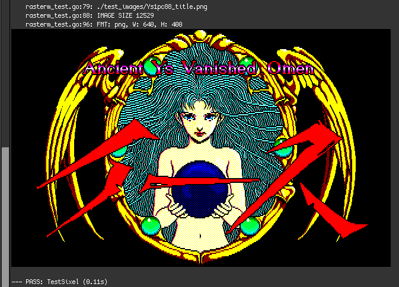

# rasterm

Package `rasterm` provides a simple way to encode images as terminal graphics,
supporting Kitty, iTerm, and Sixel.

[![Unit Tests][rasterm-ci-status]][rasterm-ci]
[![Go Reference][goref-rasterm-status]][goref-rasterm]
[![Releases][release-status]][Releases]
[![Discord Discussion][discord-status]][discord]

Fork/rewrite of [`rasterm`][original-rasterm].



[rasterm-ci]: https://github.com/kenshaw/rasterm/actions/workflows/test.yml "Test CI"
[rasterm-ci-status]: https://github.com/kenshaw/rasterm/actions/workflows/test.yml/badge.svg "Test CI"
[goref-rasterm]: https://pkg.go.dev/github.com/kenshaw/rasterm "Go Reference"
[goref-rasterm-status]: https://pkg.go.dev/badge/github.com/kenshaw/rasterm.svg "Go Reference"
[release-status]: https://img.shields.io/github/v/release/kenshaw/rasterm?display_name=tag&sort=semver "Latest Release"
[discord]: https://discord.gg/WDWAgXwJqN "Discord Discussion"
[discord-status]: https://img.shields.io/discord/829150509658013727.svg?label=Discord&logo=Discord&colorB=7289da&style=flat-square "Discord Discussion"
[releases]: https://github.com/kenshaw/rasterm/releases "Releases"
[original-rasterm]: https://github.com/BourgeoisBear/rasterm

## Using

Install in the usual Go fashion:

```sh
$ go get -u github.com/kenshaw/rasterm@latest
```
